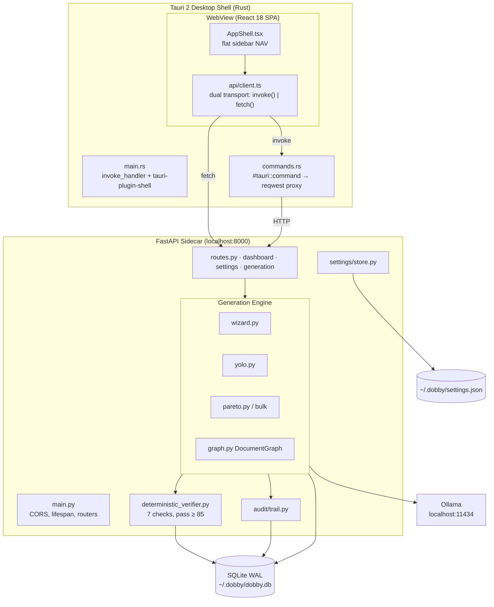
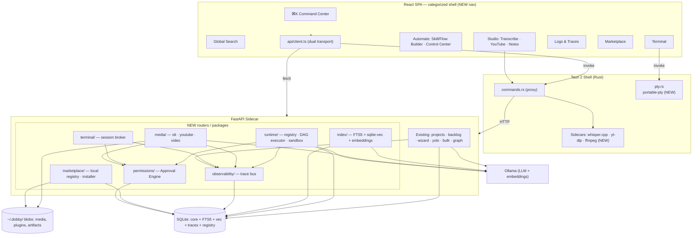
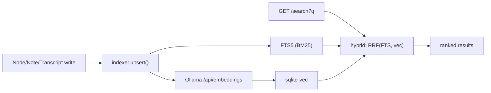
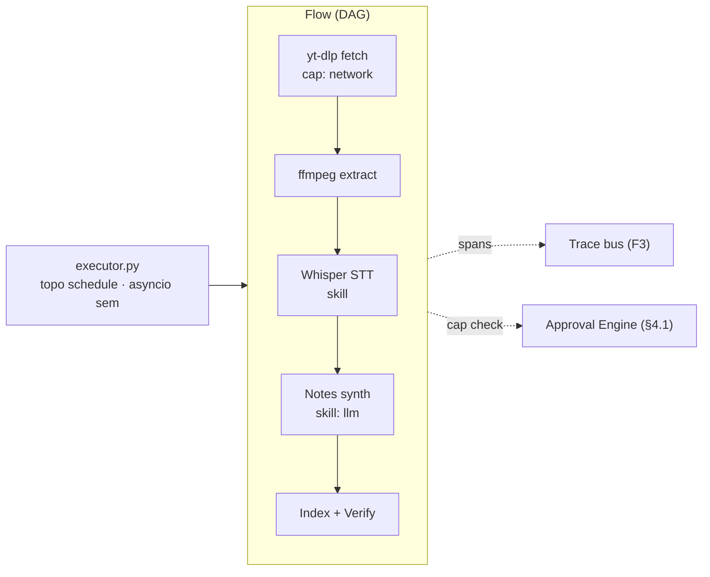
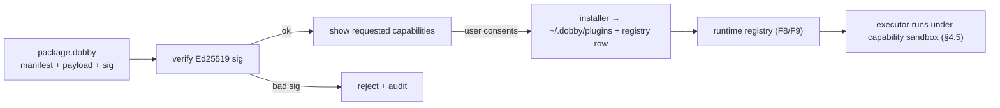
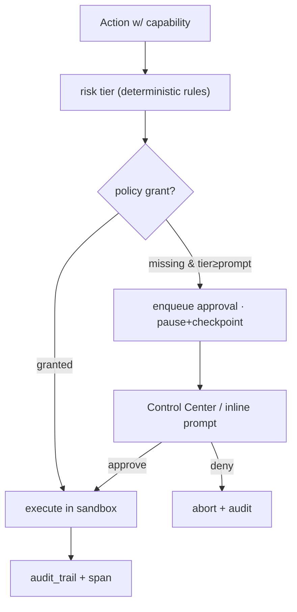

# Dobby — Design & Architecture: Evolution into a Local-First AI Workbench

> Status: design proposal · Target: Dobby v3.x · Scope: the 13 expansion features in `scratchpad/expansion_canon.md`
> Principle carried through everything below: **local-first, offline-by-default, zero cloud dependency, bring-your-own-model, deterministic verification, full audit trail.**

This document grounds every proposal in the code that exists today. Real files are cited inline (e.g. `src/db/schema.py`). Where a subsystem does not exist yet, it is called out as **new**.

---

## 1. Current Architecture (recap)

Dobby today is a **four-layer local-first desktop app**: a Tauri 2 Rust shell wraps a React/Tailwind SPA; the SPA talks to a FastAPI "sidecar" over a dual transport; FastAPI owns a SQLite database and an async Ollama client; a deterministic verifier gates every generation and an audit trail records every mutation.

### 1.1 Layers as they exist

| Layer | Tech | Key files |
|---|---|---|
| Desktop shell | Tauri 2 + `tauri-plugin-shell` | `tauri-app/src-tauri/src/main.rs`, `tauri-app/src-tauri/tauri.conf.json` |
| IPC command layer | Rust `#[tauri::command]` → `reqwest` proxy to `http://localhost:8000` | `tauri-app/src-tauri/src/commands.rs` |
| Frontend SPA | React 18, React Router, Tailwind | `tauri-app/src/App.tsx`, `tauri-app/src/components/AppShell.tsx` |
| Dual-transport client | Tauri `invoke()` in-app, `fetch()` in browser | `tauri-app/src/api/client.ts` |
| API sidecar | FastAPI + Uvicorn, structlog | `src/main.py`, `src/api/*.py` |
| LLM | Async Ollama HTTP client (`localhost:11434`) | `src/llm/ollama_client.py` |
| Generation engine | Wizard / YOLO / Bulk pipelines over a document graph | `src/pipeline/*.py`, `src/graph/graph.py` |
| Verification | 7 deterministic checks, NO LLM, pass ≥ 85 | `src/verifiers/deterministic_verifier.py` |
| Persistence | SQLite (WAL) via SQLAlchemy | `src/db/schema.py` |
| Provenance | Audit trail + revert | `src/audit/trail.py` |
| Settings | JSON at `~/.dobby/settings.json` | `src/settings/store.py` |

### 1.2 Notable design facts already true (and worth preserving)

- **Dual transport.** `client.ts` detects `__TAURI_INTERNALS__` and routes each call through `invoke()` (desktop) or `http()` to `localhost:8000` (browser/PWA). Every new feature must expose an HTTP endpoint first; the Tauri command is an optional typed proxy on top (`commands.rs`).
- **SQLite is tuned for concurrent local work.** `DatabaseManager` sets `journal_mode=WAL`, `foreign_keys=ON`, `synchronous=NORMAL`, `busy_timeout=10000` and `expire_on_commit=False` (`src/db/schema.py:355-369`). This is what lets Bulk generation commit from several concurrent tasks — the same property new background workers (transcription, indexing, flows) will rely on.
- **Verification is deterministic and pluggable.** `DeterministicVerifier.verify_section()` runs 7 checks and scores `100 - Σ penalties` with pass at 85 (`deterministic_verifier.py:558-575`). This is the seed of a general **artifact-quality gate** reused by new generators.
- **The audit trail is already a general event ledger** with `create/update/delete/verify/finalize/revert/export` actions and JSON old/new snapshots (`trail.py:28-36`). Traces and the approval ledger extend this rather than replace it.
- **Everything is keyed by `project_id`** with a seeded `default-project` (`src/main.py:23-41`). New tables should keep this tenancy key.
- **Settings are a singleton over a JSON file** (`get_settings()` in `src/settings/store.py`) read by pipelines at run time — the natural place for global permission defaults and model routing.
- **No approval/sandbox/capability engine exists yet.** The only "risk" primitive is Pareto's `risk_weight` (`src/pipeline/pareto.py:42`), the only "gate" is the verifier's pass/fail, and the only ledger is the audit trail. The target architecture *builds* the approval engine on top of these three primitives.

### 1.3 Current architecture diagram



---

## 2. Target Architecture — the AI Workbench

The workbench keeps the exact same spine (Tauri ⇄ dual transport ⇄ FastAPI ⇄ SQLite ⇄ Ollama) and adds **six new horizontal subsystems**, each a FastAPI router package plus, where native power is required, a Tauri **sidecar** or Rust command:

1. **Runtime** — a plugin / skill / flow engine (registry + DAG executor + capability sandbox).
2. **Media pipeline** — STT, YouTube ingest, audio/video extraction and (later) video generation, via bundled sidecars (Whisper.cpp, yt-dlp, ffmpeg).
3. **Search / index** — local full-text (SQLite FTS5) + semantic (sqlite-vec) over all workbench content, embeddings from Ollama.
4. **Sandboxed terminal** — a PTY hosted in Rust (`portable-pty`), approval-gated, streamed to the UI.
5. **Observability / trace bus** — a structured run/span store extending the audit trail, feeding Logs & Traces and Control Center.
6. **Marketplace** — a local package registry (signed manifests, capability sandbox) that installs skills/flows/apps; cloud publish later.

Cross-cutting through all six: the **Permission & Approval Engine** (new, built on verifier + audit + risk scoring) and the **Extensibility SDK** (how skills/flows/apps are declared and loaded).

### 2.1 Target architecture diagram



### 2.2 Directory layout (backend, additive)

```
src/
  runtime/        registry.py  executor.py  sandbox.py  skills.py  flows.py
  media/          stt.py  youtube.py  video.py  ffmpeg.py
  index/          embed.py  fts.py  vector.py  indexer.py
  terminal/       broker.py            # PTY sessions live in Rust; this brokers/approves
  observability/  tracer.py  spans.py
  marketplace/    registry.py  installer.py  manifest.py  signing.py
  permissions/    engine.py  policy.py  capabilities.py
  api/            runtime_routes.py  media_routes.py  search_routes.py
                  terminal_routes.py  trace_routes.py  marketplace_routes.py
                  command_routes.py
tauri-app/src-tauri/src/
  pty.rs          sidecar.rs          # NEW Rust modules
```

---

## 3. Per-Feature Architecture (all 13)

Each feature lists: **backend module + endpoints**, **storage/schema**, **local models/tools**, **sandboxing/permissions**, **frontend surface**, and **how it plugs into the existing engine**. Endpoints follow the existing convention (`/api/v1/...`, project-scoped where relevant, dual-transport in `client.ts`).

---

### Feature 1 — Global Search (semantic + full-text) · System · P1

- **Backend:** `src/index/` (`indexer.py`, `fts.py`, `vector.py`, `embed.py`) + `src/api/search_routes.py`.
  - `GET /api/v1/search?q=&kind=&project_id=&mode=hybrid|fts|semantic&limit=`
  - `POST /api/v1/index/reindex` (project or global), `GET /api/v1/index/status`.
- **Storage/schema:**
  - `search_documents(id, project_id, kind, ref_id, title, body, updated_at)` — canonical text of every indexable entity (nodes, backlog, notes, transcripts, traces, plugins).
  - `search_fts` — SQLite **FTS5** virtual table (`content='search_documents'`, external-content, `porter unicode61`).
  - `search_vec` — **sqlite-vec** virtual table `vec0(embedding float[768])` keyed to `search_documents.id`.
- **Local models/tools:** embeddings via Ollama `/api/embeddings` (`nomic-embed-text`, 768-dim) — a new `embed()` sibling to `generate()` in `src/llm/ollama_client.py`. Zero network beyond the local Ollama already used.
- **Sandboxing/permissions:** read-only; scoped by `project_id`. No approval needed. Indexer is a background worker that respects WAL concurrency.
- **Frontend:** top-bar Search box (fed by ⌘K, see Feature 2), results grouped by `kind`, deep-links to the owning page. New route `/search`.
- **Plugs into engine:** every write path that creates a `Node` (`yolo.py`, `wizard.py`) fires an index upsert. Hybrid ranking = reciprocal-rank-fusion of FTS BM25 and vector cosine. sqlite-vec is chosen over a separate vector DB precisely to keep the single-file, offline, `~/.dobby/dobby.db` model intact.



---

### Feature 2 — Command Center (⌘K palette + action hub) · Automate · P1

- **Backend:** `src/api/command_routes.py` exposing a machine-readable **action catalog**: `GET /api/v1/commands` returns every invokable action (navigate, run skill, run flow, generate, open terminal, reindex, install plugin…) with id, title, category, required capabilities, and argument schema. `POST /api/v1/commands/{id}/run` dispatches server-side actions (client-side ones stay in the SPA).
- **Storage/schema:** `command_history(id, project_id, command_id, args_json, ts)` for ranking recents; no new heavy tables. Catalog is assembled at request time from the router registries (runtime skills, flows, marketplace, static nav).
- **Local models/tools:** optional local LLM "natural-language → action" resolver reusing `ollama_client.generate()` with a constrained JSON prompt; deterministic fuzzy match first, LLM only as fallback.
- **Sandboxing/permissions:** the palette never executes a side-effecting action directly — it routes through the Approval Engine (§4.1). Actions declare `capabilities`; the palette greys out or prompts for anything gated.
- **Frontend:** global ⌘K modal (extends the existing `Modal.tsx`), fuzzy over commands + search results (Feature 1). Lives in `AppShell.tsx` top bar.
- **Plugs into engine:** the catalog is the single registry the whole workbench dispatches through — skills (F8), flows (F9), generation (existing), terminal (F4), all become commands. This is the connective tissue of the "one minimal app."

---

### Feature 3 — Logs & Traces (run observability) · System · P1

- **Backend:** `src/observability/tracer.py` + `src/api/trace_routes.py`.
  - `GET /api/v1/traces?project_id=&kind=&status=&since=`, `GET /api/v1/traces/{run_id}` (span tree), `GET /api/v1/traces/{run_id}/stream` (SSE for live runs).
- **Storage/schema (extends audit, does not replace it):**
  - `runs(id, project_id, kind, label, status, started_at, ended_at, error, meta_json)` — kind ∈ {yolo, wizard, bulk, flow, skill, transcription, index, terminal, video}.
  - `spans(id, run_id, parent_span_id, name, kind, input_json, output_json, tokens, model, started_at, ended_at, status)`.
  - Existing `audit_trail` remains the *authoritative mutation ledger*; `runs/spans` are the *execution ledger*. A span that mutates state cross-references its `audit_trail.id`.
- **Local models/tools:** none — pure structured capture. `structlog` (already used everywhere) gets a processor that also writes spans.
- **Sandboxing/permissions:** read-only viewer; redaction policy for captured tool I/O (never persist secrets/keys in span payloads).
- **Frontend:** new `/traces` route — run list, waterfall span timeline, token/latency metrics, live tail. Control Center (F10) reuses this data.
- **Plugs into engine:** a `Tracer` context manager wraps each pipeline entrypoint. `YOLOPipeline.generate_instant()` (`yolo.py:102`) already emits ordered `logger.info("yolo_step_N...")` events — those become spans with near-zero code change. This is the **trace bus** every other feature publishes to.

---

### Feature 4 — Embedded Terminal (sandboxed, approval-gated) · System · P2

- **Backend:** PTY lives in **Rust** (`tauri-app/src-tauri/src/pty.rs`) using **`portable-pty`** (cross-platform PTY). A thin `src/terminal/broker.py` + `src/api/terminal_routes.py` records sessions and enforces policy for the browser/PWA transport.
  - Rust commands: `terminal_open(profile) -> session_id`, `terminal_write(session_id, data)`, `terminal_resize`, `terminal_kill`; output streamed to the WebView via Tauri events.
  - HTTP mirror (PWA mode): `POST /api/v1/terminal/sessions`, WebSocket `/api/v1/terminal/{id}/io`.
- **Storage/schema:** `terminal_sessions(id, project_id, cwd, profile, started_at, ended_at)`, `terminal_commands(id, session_id, command, exit_code, ts, approved_by)` — every executed command line is audited.
- **Local models/tools:** the OS shell inside a constrained working dir; optional local-LLM "explain/suggest command" using `ollama_client`.
- **Sandboxing/permissions (this is the sharp edge):**
  - Default working dir jailed to the project's `~/.dobby/workspaces/<project_id>/`.
  - A **command classifier** assigns risk (allowlist for read-only `ls/cat/git status`; deny/prompt for `rm -rf`, network, `sudo`, package installs). Anything above the auto-run threshold is held for **approval** (§4.1) before it reaches the PTY.
  - `tauri-plugin-shell` is already initialized (`main.rs:9`) but its blanket scope is replaced by our brokered command so we control the policy, not the plugin ACL alone. `tauri.conf.json` capabilities restrict allowed sidecars.
- **Frontend:** `/terminal` route, xterm.js view, inline approval prompts for gated commands, session picker. Terminal output is indexed (F1) and traced (F3).
- **Plugs into engine:** flows (F9) and skills (F8) can request a terminal step; those requests pass through the identical Approval Engine, so a flow can't shell out unattended without policy consent.

---

### Feature 5 — Audio Transcription (local Whisper/STT) · Studio · P2

- **Backend:** **`whisper.cpp` binary bundled as a Tauri sidecar** (declared in `tauri.conf.json` `bundle`/`externalBin`, invoked via `tauri-plugin-shell` / `sidecar.rs`). `src/media/stt.py` + `src/api/media_routes.py` orchestrate jobs.
  - `POST /api/v1/media/transcribe` (multipart or file path) → `job_id`; `GET /api/v1/media/jobs/{id}` (status/progress); result is a transcript with word/segment timestamps.
- **Storage/schema:**
  - `media_assets(id, project_id, kind, source_path, duration_s, sample_rate, created_at)` (kind ∈ audio/video).
  - `transcripts(id, asset_id, project_id, language, text, segments_json, model, created_at)`. Blobs (uploaded audio) stored under `~/.dobby/media/<project_id>/`, not in SQLite.
- **Local models/tools:** whisper.cpp GGML models (`base.en`/`small`/`medium`) fetched through the same model-management UX as Ollama models; **ffmpeg** sidecar for decode/resample. Fully offline.
- **Sandboxing/permissions:** file access limited to user-selected files + the project media dir. Uploading/importing a file is a user-initiated action; long jobs run as traced background workers (F3).
- **Frontend:** `/studio/transcribe` — drag-drop, live progress, segment-aligned transcript, "→ Notes" and "→ Search" actions.
- **Plugs into engine:** transcripts become `search_documents` (F1) and can seed Notes (F7) or be a Flow input (F9). Reuses the existing job/verify/audit pattern from generation pipelines.

---

### Feature 6 — YouTube → Transcript + Audio + Notes · Studio · P2

- **Backend:** `src/media/youtube.py` + `media_routes.py`, using **`yt-dlp` as a bundled sidecar** and the ffmpeg sidecar for audio extraction.
  - `POST /api/v1/media/youtube` `{url, want: [audio, transcript, notes]}` → `job_id`. Pipeline: yt-dlp fetch (prefer author/auto captions when present → skip STT) → else extract audio → Whisper (F5) → optional Notes (F7).
- **Storage/schema:** reuses `media_assets` + `transcripts`; adds `source_url`, `source_meta_json` (title, channel, duration) to `media_assets`.
- **Local models/tools:** yt-dlp, ffmpeg, whisper.cpp (all local sidecars), Ollama for note synthesis.
- **Sandboxing/permissions:** **network egress to YouTube is the one deliberate exception to offline-by-default** and is therefore **explicitly permission-gated** (§4.2): a per-session/allowlist consent, surfaced clearly ("this will contact youtube.com"). No other outbound traffic is introduced. Downloaded media is capped/quota'd and stored in the project media dir.
- **Frontend:** `/studio/youtube` — paste URL, choose outputs, watch the traced pipeline, land on transcript/notes.
- **Plugs into engine:** it is a **pre-built Flow** (F9) composed of media + STT + notes steps — the first "flow shipped as a feature," validating the runtime.

---

### Feature 7 — Notes Builder (AI notes from any source) · Studio · P2

- **Backend:** `src/media/` note synthesis or a dedicated `src/notes.py` + endpoints under `media_routes.py`.
  - `POST /api/v1/notes` `{source_ref | text, style: summary|outline|action_items|study}` → note; `GET/PUT /api/v1/notes/{id}`.
- **Storage/schema:** `notes(id, project_id, title, body_md, source_kind, source_ref, style, created_at, updated_at)`. Modeled closely on the existing `Node` shape so it inherits versioning/audit conventions.
- **Local models/tools:** `ollama_client.generate()` with style-specific prompts (a new prompt family alongside the wizard prompts in `ollama_client.py`).
- **Sandboxing/permissions:** none beyond read access to the referenced source; generations are traced.
- **Frontend:** `/studio/notes` — source picker (transcript, document, search result, pasted text), style selector, editable markdown output.
- **Plugs into engine:** runs the same **generate → deterministic-verify → audit** loop as YOLO. `DeterministicVerifier.verify_section()` is reused with a `documentation`-like profile; notes are indexed (F1).

---

### Feature 8 — Skill Builder (author reusable AI skills) · Automate · P3

- **Backend:** `src/runtime/skills.py` + `registry.py`, `src/api/runtime_routes.py`.
  - `GET /api/v1/skills`, `POST /api/v1/skills` (create/import), `POST /api/v1/skills/{id}/run` `{inputs}` → traced run, `GET /api/v1/skills/{id}`.
- **Storage/schema:** `skills(id, project_id|null, name, version, manifest_json, source, enabled, installed_from, signature, created_at)`. A **skill = a signed manifest** (see SDK, §4.7): declared inputs/outputs, the prompt/template or handler, required `capabilities`, and model preferences.
- **Local models/tools:** a skill's default runtime is a parametrized Ollama prompt (reusing `ollama_client`); advanced skills may call tools (search, terminal, media) — each requiring the matching capability.
- **Sandboxing/permissions:** every skill runs under the **capability sandbox** (§4.5). A skill with no `terminal` capability can never open a PTY; a skill with no `network` capability can never reach YouTube. Capabilities are declared in the manifest and enforced by the executor, not by the skill's own code.
- **Frontend:** `/automate/skills` — form/DSL editor, input schema builder, live test run with trace, "publish to Marketplace" (F13).
- **Plugs into engine:** a skill is the smallest unit the DAG executor (F9) schedules and the Command Center (F2) dispatches. Skills are the reusable, shareable atom of the whole workbench.

---

### Feature 9 — Flow Builder (visual multi-step automations) · Automate · P3

- **Backend:** `src/runtime/flows.py` + **`executor.py` (a DAG executor)**, `runtime_routes.py`.
  - `GET/POST /api/v1/flows`, `POST /api/v1/flows/{id}/run` → `run_id` (traced), `GET /api/v1/flows/{id}/runs`.
  - Executor: topological schedule over nodes; each node is a skill (F8), a generator (wizard/yolo), a media step (F5/F6), a terminal step (F4), a search/index step (F1), or a control node (branch/loop/map). Concurrency uses `asyncio` (the pattern Bulk already uses) bounded by a semaphore; each node emits a span.
- **Storage/schema:** `flows(id, project_id, name, version, graph_json, capabilities_json, created_at)`, `flow_runs(id, flow_id, status, run_id, started_at, ended_at)`. `graph_json` reuses the same node/edge shape as `src/graph/graph.py` so the existing `GraphViewer.tsx`/mermaid tooling can render a flow.
- **Local models/tools:** whatever the member skills/steps use — the flow itself is orchestration only.
- **Sandboxing/permissions:** a flow's **effective capability set is the union of its steps', and every capability is consented once at flow level** before the run, with per-step re-prompts for high-risk actions (terminal, network, delete). Runs are checkpointed so an approval pause can resume (extends `Session.state`, `schema.py:311`).
- **Frontend:** `/automate/flows` — node-graph canvas (build on `GraphViewer.tsx`), run inspector wired to Traces (F3).
- **Plugs into engine:** the DAG executor **generalizes the fixed 7-step YOLO chain** (`yolo.py:153-205`) into arbitrary graphs. YOLO/Wizard become built-in flow templates; F6 (YouTube→Notes) ships as a stock flow.



---

### Feature 10 — Control Center (agents/permissions/orchestration) · System · P3

- **Backend:** aggregates runtime + observability + permissions: `GET /api/v1/control/runs` (active), `POST /api/v1/control/runs/{id}/cancel|pause|resume`, `GET/PUT /api/v1/permissions/policy`, `GET /api/v1/control/approvals` (pending queue), `POST /api/v1/control/approvals/{id}/decide`.
- **Storage/schema:** `permission_policy(id, scope, capability, decision, expires_at)` and `approvals(id, run_id, span_id, capability, request_json, status, decided_by, decided_at)`. See §4.1.
- **Local models/tools:** none — it is the cockpit over the trace bus and approval queue.
- **Sandboxing/permissions:** *this is where the policy is edited*; changing a standing policy is itself a gated, audited action.
- **Frontend:** `/system/control` — live run table (kill/pause/resume), pending-approval inbox, capability policy matrix, per-plugin capability grants (F13).
- **Plugs into engine:** it is the human-facing surface of the Approval Engine (§4.1) and executor (F9). Nothing new conceptually — it *renders and controls* the cross-cutting subsystems.

---

### Feature 11 — Prototype Builder + Test · Generate · P4

- **Backend:** `src/runtime/` (as a specialized flow) or `src/proto/` + endpoints: `POST /api/v1/prototypes` `{spec | feature_node_id}` → scaffolds a runnable app into `~/.dobby/workspaces/<project_id>/<proto_id>/`; `POST /api/v1/prototypes/{id}/run` (dev server via terminal/sidecar); `POST /api/v1/prototypes/{id}/test`.
- **Storage/schema:** `prototypes(id, project_id, feature_node_id, framework, workspace_path, dev_url, status, created_at)`, `prototype_runs(...)`.
- **Local models/tools:** Ollama for code generation; the **PTY (F4)** to install deps, run dev server, run tests; ffmpeg/none. Preview shown via a Tauri webview pointed at the local dev URL.
- **Sandboxing/permissions (highest-risk feature):** all execution goes through the **sandboxed terminal** — dependency installs and dev-server launches are network/exec actions and are **approval-gated**. Workspace is jailed per project. Generated tests run before the preview is trusted, reusing the deterministic-verifier philosophy (build/test *pass* is the gate, analogous to score ≥ 85).
- **Frontend:** `/generate/prototype` — spec → scaffold → live preview pane → test results, all traced.
- **Plugs into engine:** it is the most ambitious **flow**: generation → files → terminal → test → preview. It reuses F4 (terminal), F9 (executor), F3 (traces), and the existing feature-node lineage (a prototype attaches to a `feature` node created by wizard/yolo).

---

### Feature 12 — Video Generation · Generate/Studio · P4

- **Backend:** `src/media/video.py` + `media_routes.py`. Composition-first (deterministic, offline): script/storyboard from Ollama → TTS narration → slides/visuals → **ffmpeg** assembles the video. Optional local generative-video model as a pluggable sidecar when hardware permits.
  - `POST /api/v1/media/video` `{script | notes_ref, style}` → `job_id`; result is an `.mp4` in the project media dir.
- **Storage/schema:** reuses `media_assets` (kind=video) + a `video_projects(id, project_id, timeline_json, assets_json, status)` for the editable timeline.
- **Local models/tools:** Ollama (script), a local TTS engine (e.g. Piper as a sidecar), ffmpeg (assembly). Heavy generative models are opt-in and capability-flagged (GPU/compute).
- **Sandboxing/permissions:** compute-heavy jobs are traced background workers with cancel via Control Center (F10); no network by default. Large model downloads are consented like other model pulls.
- **Frontend:** `/generate/video` (Video Studio) — timeline editor, render queue, preview.
- **Plugs into engine:** consumes Notes/transcripts (F5-F7), is orchestratable as a flow step (F9), outputs indexed media (F1).

---

### Feature 13 — Local App Marketplace → Publish (cloud) · Marketplace · P5-P6

- **Backend:** `src/marketplace/` (`registry.py`, `installer.py`, `manifest.py`, `signing.py`) + `src/api/marketplace_routes.py`.
  - `GET /api/v1/marketplace` (browse local registry), `POST /api/v1/marketplace/install` `{package_ref}`, `DELETE /api/v1/marketplace/{id}`, `GET /api/v1/marketplace/{id}/manifest`. Cloud publish (P6): `POST /api/v1/marketplace/publish` to a remote registry — the *only* new outbound integration, entirely opt-in.
- **Storage/schema:** `packages(id, kind, name, version, publisher, manifest_json, signature, capabilities_json, installed_at, source)` where kind ∈ {skill, flow, app}; installed skills/flows also register into their own tables (F8/F9).
- **Local models/tools:** none intrinsic; installed packages declare the models they need and trigger the same Ollama/whisper model-pull UX.
- **Sandboxing/permissions (the trust boundary):**
  - A package is a **signed manifest + payload**. On install, Dobby verifies the **signature** (Ed25519) against the publisher key and shows the **requested capabilities** for explicit user consent (like a mobile app permission sheet).
  - At run time the installed skill/flow executes under the **capability sandbox** (§4.5) — it can only touch subsystems it was granted (`llm`, `search`, `fs:project`, `terminal`, `network`, `media`). No ambient authority.
  - Local-first now: the "registry" is a folder/db of packages under `~/.dobby/plugins/`; P6 adds a cloud registry but the install/verify/sandbox path is unchanged — cloud is just another *source*.
- **Frontend:** `/marketplace` (Skills / Flows / Apps tabs) — browse, capability-diff on install, manage/uninstall, publish wizard (P6).
- **Plugs into engine:** the marketplace is the distribution channel for the SDK artifacts (§4.7). Installed items appear automatically in Command Center (F2), Skill/Flow builders (F8/F9), and Control Center's capability matrix (F10).



---

## 4. Cross-Cutting Architecture

### 4.1 Permission & Approval Engine (new, built on existing primitives)

There is no approval engine today; there **are** three primitives to build it from: Pareto **risk scoring** (`src/pipeline/pareto.py`), the verifier's **pass/fail gate** (`deterministic_verifier.py`), and the **audit trail** (`src/audit/trail.py`). The engine composes them:

- **Every side-effecting action carries a `capability` and a computed `risk` tier** (`auto`, `prompt`, `deny`). Risk is deterministic and rule-based first (mirroring the "NO LLM verification" stance), e.g. `rm -rf`, `network egress`, `install`, `delete`, `publish` are high tier.
- **The engine is the single chokepoint** through which the terminal (F4), flows (F9), skills (F8), media network (F6), prototype exec (F11), and marketplace install (F13) must pass before touching a subsystem.
- **Decision flow:** action → capability + risk → check `permission_policy` (standing grants) → if uncovered and tier ≥ prompt, enqueue an `approvals` row and **pause the run** (checkpoint in `Session.state`) → user decides in Control Center / inline prompt → decision recorded in `audit_trail` with `action="approve"|"deny"` → run resumes or aborts.
- **Grants are scoped and expiring** (`permission_policy.scope`, `expires_at`) — per-action, per-session, or standing; standing grants are themselves audited when created.
- Aligns with the harness's own action-category model (regular / permission-required / prohibited) so behavior is predictable to users.



### 4.2 Local-first data model & offline guarantees

- **One SQLite file** (`~/.dobby/dobby.db`, WAL) stays the source of truth. New subsystems add **tables**, not new datastores — FTS5 and sqlite-vec are SQLite extensions living *in the same file*, preserving single-file backup/restore (`DatabaseManager.backup/restore`, `schema.py:408-427`).
- **Blobs live on disk, not in the DB:** media, plugin payloads, prototype workspaces, rendered video under `~/.dobby/{media,plugins,workspaces,artifacts}/<project_id>/`. The DB stores paths + metadata.
- **Offline by default.** Every core capability runs with only local Ollama + bundled sidecars. **Exactly two features touch the network and both are explicitly gated:** YouTube ingest (F6) and cloud publish (F13, P6). Everything else has zero egress; the app is fully functional on a plane.
- **BYO model:** models (Ollama LLM/embeddings, whisper.cpp, TTS) are user-managed via the existing model-management UX (`settings_routes.py`), never bundled weights the user can't swap.
- **Tenancy:** everything keyed by `project_id` with the seeded `default-project` (`main.py`), so multi-project isolation and per-project export/backup are natural.

### 4.3 Security & sandboxing

- **Native power is isolated in Rust sidecars** with declared scopes in `tauri.conf.json` capabilities, replacing the current blanket `tauri-plugin-shell` scope (`main.rs:9`). Today `csp` is `null` and macOS entitlements/signing are unset (`tauri.conf.json:23-44`) — hardening these is a prerequisite before shipping the terminal/marketplace.
- **Capability sandbox** (§4.5) governs all extension code; **signed manifests** (Ed25519) gate what can be installed (F13).
- **Redaction:** trace/span payloads and audit snapshots must scrub secrets/tokens (never persist credentials).
- **The FastAPI sidecar binds `0.0.0.0:8000` today** (`main.py:172`) — for a local-first app this should bind `127.0.0.1` and/or require a loopback token, especially once the terminal can execute commands. Called out as a **security must-fix**.

### 4.4 Observability / traces

The trace bus (F3) is the spine: a `Tracer` wraps every entrypoint, spans nest under a `run`, and the audit trail remains the mutation ledger cross-referenced from spans. Control Center (F10) and Logs & Traces (F3) are two views over the same `runs`/`spans` tables. `structlog` (already pervasive) is the capture mechanism.

### 4.5 The capability sandbox

Extensions never get ambient authority. The executor injects a **capability-scoped context object** exposing only granted subsystems:

| Capability | Grants access to | Backing subsystem |
|---|---|---|
| `llm` | text generation / embeddings | `ollama_client.py` |
| `search` | query the index | `src/index/` |
| `fs:project` | read/write the project workspace dir | jailed path |
| `terminal` | run brokered commands | F4 (approval-gated) |
| `network` | outbound HTTP to allowlisted hosts | F6 pattern (gated) |
| `media` | STT / ffmpeg / video | `src/media/` |
| `db:read` / `db:write` | scoped project data | SQLAlchemy session |

A skill/flow/app calls, say, `ctx.llm.generate(...)`; the object only exists if the capability was declared and granted. The executor enforces this — extension code cannot import `ollama_client` directly.

### 4.6 Packaging & updates

- Ship whisper.cpp, yt-dlp, ffmpeg, (Piper) as **Tauri sidecars** (`externalBin` in `tauri.conf.json`, invoked via `sidecar.rs`) — versioned with the app, verified by checksum.
- **App updates** via `tauri-plugin-updater` (signed release artifacts). **Model updates** stay user-driven through the existing pull UX.
- **DB migrations:** `Base.metadata.create_all` (`schema.py:373`) is create-only and additive today; introducing Alembic (or a lightweight versioned-migration runner) is required before shipping the new tables, so upgrades don't lose the local DB.
- Single-file backup/restore already exists and extends cleanly (blobs backed up alongside the DB file).

### 4.7 Extensibility SDK — how skills / flows / apps are defined and loaded

- **Manifest format** (`skill.dobby.json` / `flow.dobby.json` / `app.dobby.json`): `{ id, name, version, kind, publisher, capabilities[], inputs, outputs, models[], entry, signature }`.
- **Skill** = manifest + a handler (a parametrized prompt template by default, or a Python entry running under the capability context).
- **Flow** = manifest + `graph_json` (nodes referencing skills/steps + control nodes) executed by `executor.py`; reuses the `src/graph/graph.py` node/edge shape so it renders in `GraphViewer.tsx`.
- **App** = manifest + a frontend surface (a lazy-loaded route/panel) + optional backing skills/flows.
- **Loading:** on startup and after install, `runtime/registry.py` scans `~/.dobby/plugins/`, verifies signatures, registers enabled packages into the skills/flows tables, and surfaces them in Command Center (F2). The **same registry path serves built-in, locally-authored, and marketplace-installed** artifacts — one code path, three sources.
- **Authoring** happens in Skill/Flow Builders (F8/F9), which export a signable package the Marketplace (F13) can install or publish.

---

## 5. Key Technical Decisions & Trade-offs

| Decision | Choice | Alternatives considered | Trade-off / rationale |
|---|---|---|---|
| Vector store | **sqlite-vec** in the existing DB file | Chroma, LanceDB, Qdrait, FAISS sidecar | Keeps single-file, offline, one-backup model (`schema.py` backup/restore). Slightly less scale than a dedicated engine, but fine for local corpora. |
| Full-text search | **SQLite FTS5** (BM25) + RRF hybrid | External Meilisearch/Tantivy | No extra process; ships inside SQLite; hybrid with vec gives quality without cloud. |
| Embeddings | **Ollama `nomic-embed-text`** (local) | Cloud embeddings, sentence-transformers py dep | Reuses the LLM the user already runs; zero new runtime, zero egress. |
| STT | **whisper.cpp sidecar** (GGML) | faster-whisper (Python), cloud STT | C++ binary, no Python ML stack, GPU-optional, fully offline; matches BYO-model ethos. |
| Media fetch/transcode | **yt-dlp + ffmpeg sidecars** | Python libs, cloud APIs | Battle-tested binaries; network (yt-dlp) is the one gated exception. |
| Terminal PTY | **Rust `portable-pty`** in the shell | Python `pty`/`ptyprocess`, node-pty | Native, cross-platform, lives in the trusted Rust layer where sandboxing is enforceable; Python `pty` is POSIX-only. |
| Flow execution | **Custom asyncio DAG executor** | Prefect/Temporal/Airflow, LangGraph | Those are heavy/cloud-leaning; a small executor reuses the asyncio+semaphore pattern Bulk already uses and the existing graph model. |
| Approval engine | **Build on verifier + audit + risk scoring** | Adopt an external policy engine (OPA) | Reuses in-house primitives, stays offline and dependency-light; deterministic rules mirror the "NO LLM verification" stance. |
| Verification of new artifacts | **Reuse `DeterministicVerifier`** | LLM-judge | Deterministic, offline, reproducible — the project's core stance (`deterministic_verifier.py`). |
| Plugin trust | **Ed25519-signed manifests + capability sandbox** | Unsigned scripts, full-trust plugins | No ambient authority; users consent to explicit capabilities; safe to install from cloud later. |
| Transport for new features | **HTTP endpoint first, Tauri command optional** | Tauri-only commands | Preserves the PWA/browser path in `client.ts`; native commands only where IPC/streaming/PTY need it. |
| Migrations | **Add Alembic (or versioned runner)** | Keep create-only `create_all` | Additive `create_all` (`schema.py:373`) can't evolve columns safely once users have data. Required before new tables ship. |
| API bind address | **Switch `0.0.0.0` → `127.0.0.1` + loopback token** | Keep `0.0.0.0:8000` | Local-first + a command-executing terminal must not be reachable off-host (`main.py:172`). Security must-fix. |
| Tauri hardening | **Set CSP, entitlements, signing; scoped capabilities** | Keep `csp:null`, blanket shell scope | Current config (`tauri.conf.json`) is dev-grade; prerequisite for terminal + marketplace. |
| Video generation | **Composition-first (script+TTS+ffmpeg)**, generative model opt-in | Pure generative video model | Deterministic, runs on modest hardware, offline; heavy models are capability-flagged opt-ins. |

---

### Appendix — mapping features to phases & subsystems

| # | Feature | Phase | New backend pkg | New Rust | New tables |
|---|---|---|---|---|---|
| 1 | Global Search | P1 | `index/` | – | search_documents, search_fts, search_vec |
| 2 | Command Center | P1 | `api/command_routes` | – | command_history |
| 3 | Logs & Traces | P1 | `observability/` | – | runs, spans |
| 4 | Terminal | P2 | `terminal/` | `pty.rs` | terminal_sessions, terminal_commands |
| 5 | Audio Transcription | P2 | `media/stt` | `sidecar.rs` | media_assets, transcripts |
| 6 | YouTube → Notes | P2 | `media/youtube` | (sidecars) | (reuses media) |
| 7 | Notes Builder | P2 | `media`/`notes` | – | notes |
| 8 | Skill Builder | P3 | `runtime/skills` | – | skills |
| 9 | Flow Builder | P3 | `runtime/flows`+`executor` | – | flows, flow_runs |
| 10 | Control Center | P3 | `permissions/`+control routes | – | permission_policy, approvals |
| 11 | Prototype Builder | P4 | `proto/`/runtime | (uses pty) | prototypes, prototype_runs |
| 12 | Video Generation | P4 | `media/video` | (sidecars) | video_projects (reuses media) |
| 13 | Marketplace | P5-P6 | `marketplace/` | – | packages |

The nav redesign from `expansion_canon.md` (Workspace / Generate / Studio / Automate / System / Marketplace) is implemented by regrouping the flat `NAV` array in `AppShell.tsx:25-35` into six collapsible categories — a pure frontend change that every feature above slots into.
