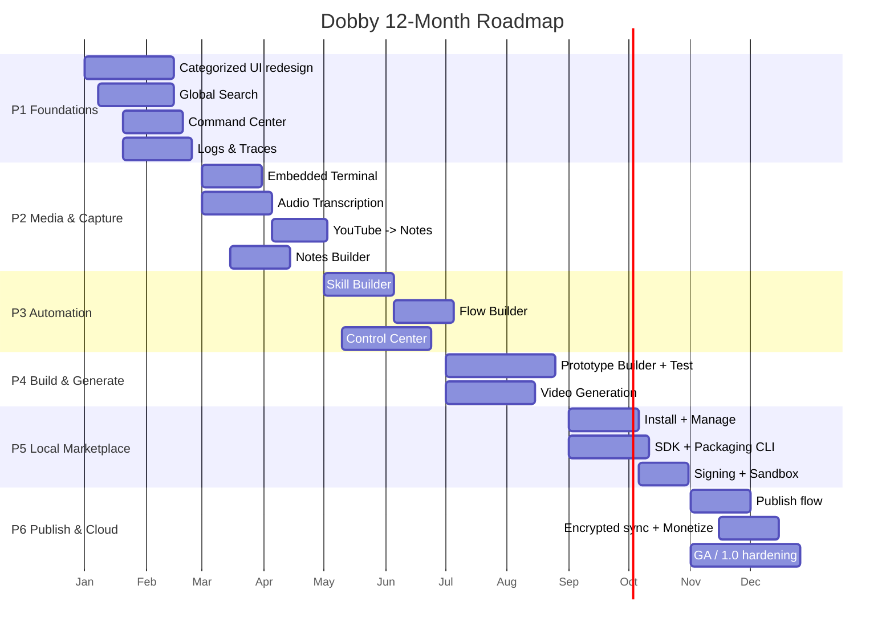

# Dobby Expansion — Project Plan (12-Month Roadmap)

**From:** local-first document generator → **local-first AI workbench / "AI OS for builders."**
**Team:** founder-led startup, scaling ~3 → ~6 people over 12 months.
**Capacity:** ~300 person-weeks theoretical ceiling; **247 person-weeks planned** (~82% utilization, ~18% held as integration/risk buffer — deliberate for a small team).
**Stack constraint:** everything on-device (Tauri 2 + React + FastAPI + SQLite + local Ollama/llama.cpp), zero cloud dependency until P6 (opt-in only).

---

## 1. Timeline at a glance

| Phase | Months | Theme | Features | Planned PW | Team | Capacity (PW) |
|-------|--------|-------|----------|-----------:|:----:|-------------:|
| **P1** | 1–2 | Foundations & Findability | Categorized UI redesign, Global Search, Command Center, Logs & Traces | 32 | 3 | ~26 |
| **P2** | 3–4 | Media & Capture Studio | Terminal, Audio Transcription, YouTube→Notes, Notes Builder | 42 | 5 | ~43 |
| **P3** | 5–6 | Automation | Skill Builder, Flow Builder, Control Center | 49 | 6 | ~52 |
| **P4** | 7–8 | Build & Generate | Prototype Builder + Test, Video Generation | 54 | 6 | ~52 |
| **P5** | 9–10 | Local Marketplace | Marketplace install + SDK | 39 | 6 | ~52 |
| **P6** | 11–12 | Publish & Cloud | Marketplace publish + cloud/sync/monetization, GA | 31 | 6 | ~52 |
| | | | **Total** | **247** | | **~277** |

> **Note on P1:** planned work (32 PW) slightly exceeds a 3-person capacity (~26 PW). This is a known, deliberate crunch — mitigated by shipping MVP-scoped versions behind flags and the founder contributing directly (see Risk R1). P5/P6 intentionally carry buffer for marketplace integration unknowns and GA hardening.

### Mermaid Gantt



---

## 2. Phase-by-phase detail, milestones & gates

Each phase ends at a **gate**: work does not start on the next phase's headline features until the gate criteria pass. Gates are the exit_criteria in `roadmap.json`, summarized below.

### P1 — Foundations & Findability (Mo 1–2)
The redesign and observability layer that everything else plugs into.
- **M1.1** (Mo 1): New categorized shell live behind a flag.
- **M1.2** (Mo 1): Local embeddings index + hybrid search returning results.
- **M1.3** (Mo 2): ⌘K palette wired to core actions.
- **M1.4** (Mo 2): Run traces visible for the existing generation pipeline.
- **Gate G1:** IA has no dead ends; search < 500ms on 5k docs; 80% of actions in ⌘K; every run traced.

### P2 — Media & Capture Studio (Mo 3–4)
- **M2.1** (Mo 3): Sandboxed terminal with per-command approval.
- **M2.2** (Mo 3): Local Whisper transcription of an uploaded file.
- **M2.3** (Mo 4): YouTube URL → transcript + audio pipeline.
- **M2.4** (Mo 4): Notes Builder producing structured notes from a transcript.
- **Gate G2:** no terminal command runs without approval; transcription offline; YouTube→(transcript+audio+notes) in one flow.

### P3 — Automation (Mo 5–6)
- **M3.1** (Mo 5): Author + save + run a first reusable skill.
- **M3.2** (Mo 5): Visual flow chaining 3+ skills with branching.
- **M3.3** (Mo 6): Control Center with permission + pause controls.
- **M3.4** (Mo 6): Skill/Flow runs fully visible in Logs & Traces.
- **Gate G3:** skills reusable across projects; flows execute with per-step traces; all agent actions permission-scoped + revocable.

### P4 — Build & Generate (Mo 7–8)
- **M4.1** (Mo 7): Prototype generation from a PRD with live preview.
- **M4.2** (Mo 8): Automated test pass over a generated prototype.
- **M4.3** (Mo 8): First end-to-end local video render.
- **Gate G4:** prototype generated + previewed + iterated in-app; test loop reports results; video clip produced on-device.

### P5 — Local Marketplace (Mo 9–10)
- **M5.1** (Mo 9): Install/uninstall a packaged skill locally.
- **M5.2** (Mo 9): SDK + packaging CLI v0 published.
- **M5.3** (Mo 10): Permission + signature verification on install.
- **Gate G5:** third-party item installs and runs safely; builders can package via SDK; installed items sandboxed + signed.

### P6 — Publish & Cloud (Mo 11–12)
- **M6.1** (Mo 11): Publish from local package to shared marketplace.
- **M6.2** (Mo 11): Opt-in encrypted device sync.
- **M6.3** (Mo 12): Monetization + licensing rails live.
- **M6.4** (Mo 12): GA / 1.0 release.
- **Gate G6 (1.0):** publish→install works cross-user; sync opt-in + E2E encrypted + off by default; licensing enforced; crash-free/documented/secured.

---

## 3. Dependencies (what blocks what)

```
Categorized UI redesign ──┬─> every subsequent feature (they mount into the new IA)
                          │
Logs & Traces ────────────┼─> Terminal, Skill Builder, Flow Builder, Control Center,
                          │    Prototype Builder (all runs must be observable)
                          │
Command Center ───────────┴─> Skill Builder, Flow Builder (actions/skills register into ⌘K)

Global Search ──────────────> Notes Builder (notes indexed & findable)

Audio Transcription ────────> YouTube→Notes ──> Notes Builder
                                                   ^
Audio Transcription ───────────────────────────────┘

Skill Builder ──> Flow Builder (flows compose skills)
Skill Builder + Flow Builder ──> Control Center (governs what they run)
Control Center ──> Prototype Builder + Test (sandboxed exec + permissions reused)

Skill Builder + Flow Builder + Prototype Builder ──> Local Marketplace (install targets)
Marketplace install + SDK (P5) ──> Marketplace publish + cloud (P6)
```

**Critical path:** UI redesign → Logs & Traces → Skill Builder → Flow Builder → Control Center → Prototype Builder → Marketplace (install → publish). Slippage here slips the whole line; P2 Studio work is largely parallelizable off the critical path.

---

## 4. Staffing ramp

| Phase | Headcount | Roles on the team |
|-------|:---------:|-------------------|
| P1 | 3 | Founder (product + full-stack), 1 full-stack eng, 1 frontend/design (part-time design contractor for the redesign) |
| P2 | 5 | + 1 ML/media eng (Whisper/audio/video), + 1 backend eng (terminal sandbox, pipelines) |
| P3 | 6 | + 1 full-stack eng (automation surfaces); founder shifts toward product/GTM |
| P4 | 6 | same 6; ML/media eng leads video, full-stack leads Prototype Builder |
| P5 | 6 | same 6; backend-heavy (packaging, signing, SDK) |
| P6 | 6 | same 6; +fractional part-time QA/security contractor for GA hardening |

Discipline mix across the plan (from `effort.json` breakdowns): Frontend ~76 PW, Backend ~87 PW, ML/Media ~34 PW, Design ~19 PW, QA ~48 PW (of which a dedicated cross-cutting Hardening/QA/Docs line is 32 PW).

---

## 5. Risk register (top 6)

| # | Risk | Likelihood / Impact | Mitigation |
|---|------|:-------------------:|------------|
| **R1** | **P1 overload** — 4 substantial features + a full redesign for only 3 people. | High / High | Ship MVP-scoped versions behind flags; founder contributes directly; treat search/traces as thin-slice first, deepen in P2 buffer. Accept G1 on "good enough," not "complete." |
| **R2** | **On-device model performance** — Whisper/video/embeddings too slow on low-end laptops. | Med / High | Model-tier selection (CPU vs GPU), quantized models, background jobs with progress/cancel, per-feature perf budgets tracked in Hardening line. |
| **R3** | **Security of exec surfaces** — Terminal, Skills, Flows, and installed marketplace items can run arbitrary code on the user's machine. | Med / Critical | Approval-gating by default, sandboxing + working-dir confinement, permission scoping via Control Center, signature verification on install, dedicated security review each phase. |
| **R4** | **Scope creep on XL items** — Prototype Builder and Marketplace can each absorb unlimited effort. | High / High | Hard-cap PW per phase; strict exit_criteria as MVP definition; defer "nice-to-have" into post-1.0 backlog; timebox spikes. |
| **R5** | **Hiring/ramp slip** — small startup may not land the ML and backend hires on schedule (P2/P3). | Med / High | Front-load recruiting in P1; keep P2 Studio work parallel/deferrable; fall back to lighter-weight local models if ML hire slips; use contractors for design/QA. |
| **R6** | **Local-first vs cloud tension (P6)** — publish/sync/monetization risks eroding the privacy positioning that is the core differentiator. | Med / High | Cloud strictly opt-in and off by default; end-to-end encryption for sync; no telemetry without consent; clear data-boundary docs; local-first remains the default path through 1.0. |

---

## 6. Definition of Done (per phase)

**Global DoD (applies to every feature, every phase):**
- Reachable through the categorized IA; invokable from ⌘K where applicable.
- Every run emits a viewable trace in Logs & Traces.
- Works fully offline / on-device (no cloud dependency unless P6 opt-in).
- Covered by automated tests; passes the phase regression suite.
- Permission-scoped where it executes code or touches the filesystem.
- User-facing docs / changelog entry written.

**Per-phase additions:**
- **P1 DoD:** old navigation removed or flag-defaulted to new; search relevance + latency benchmarked; ⌘K action-registry documented for future features.
- **P2 DoD:** terminal audited (no unapproved execution); transcription accuracy benchmark recorded; YouTube→Notes resilient to fetch/format failures.
- **P3 DoD:** a skill authored once runs in a flow and from ⌘K; flows handle step failure with retries; Control Center can pause/revoke any live agent.
- **P4 DoD:** a generated prototype runs a full generate→preview→test→iterate loop; video render has progress + cancel; both governed by Control Center.
- **P5 DoD:** install/uninstall is atomic and reversible; SDK has a reference + example package; every installed item is signed, sandboxed, and permission-scoped.
- **P6 DoD (1.0 bar):** publish→install verified cross-user; sync opt-in + E2E encrypted + default-off; licensing enforced; crash-free rate meets target; security review closed; full docs + SDK reference shipped.
